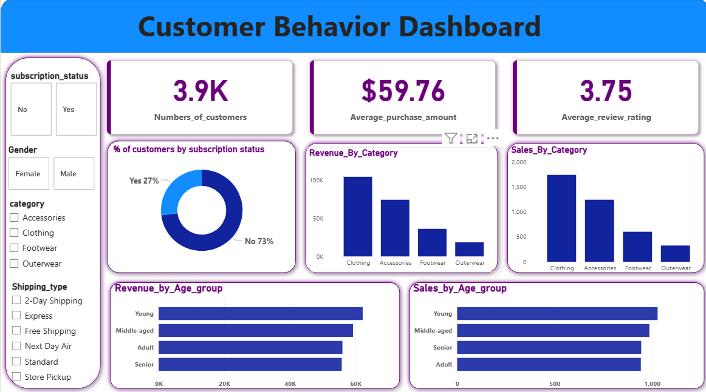

# Customer_Behavior_Analysis
**End-to-end data analysis project that cleans customer transaction data using Python, stores it in PostgreSQL, and visualizes revenue insights and customer segments in Power BI.**

**Project Overview**

This project focuses on analyzing customer behavior using a complete data analytics workflow. The dataset was processed using Python to perform data cleaning and exploratory data analysis (EDA). The cleaned data was then stored and queried using PostgreSQL, and key business insights were visualized through an interactive Power BI dashboard.

The goal of this project is to understand customer purchasing patterns, revenue distribution across age groups, and key factors influencing customer behavior.

**Tools & Technologies**

Python

Pandas

PostgreSQL

Microsoft Power BI

Visual Studio Code

**Project Workflow**

1️⃣ Data Loading

The dataset was loaded into Python using Pandas for further analysis.

2️⃣ Data Cleaning

Data preprocessing steps included:

Handling missing values

Removing duplicate records

Converting column data types

Standardizing column names

3️⃣ Exploratory Data Analysis (EDA)

Exploratory analysis was performed to understand:

Customer demographics

Purchase patterns

Revenue trends

Distribution of transactions across different age groups

4️⃣ Database Integration

The cleaned dataset was loaded into PostgreSQL for structured storage and querying.

SQL queries were used to extract business insights such as:

Revenue by age group

Most active customer segments

Purchase frequency patterns

5️⃣ Data Visualization

An interactive dashboard was built using Power BI to visualize key insights, including:

Revenue distribution by age group

% of customers by Subscription Status

Revenue by product Category

Sales by age group

Customer segmentation

Sales trends

Key performance indicators (KPIs)

# Dashboard Preview:

**Author**

Arun Yadav

